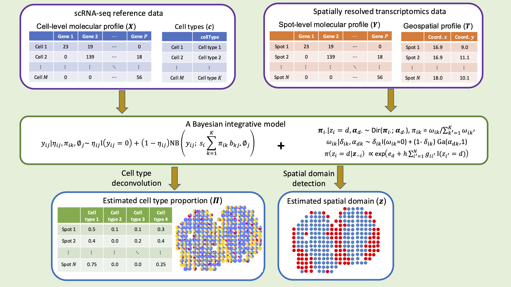
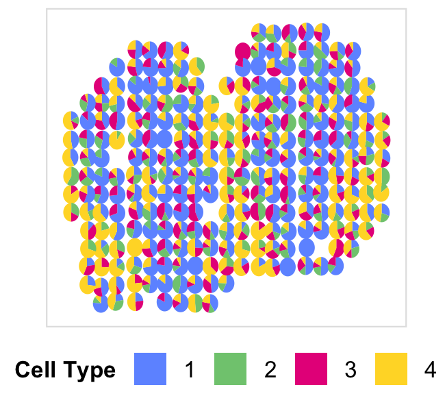
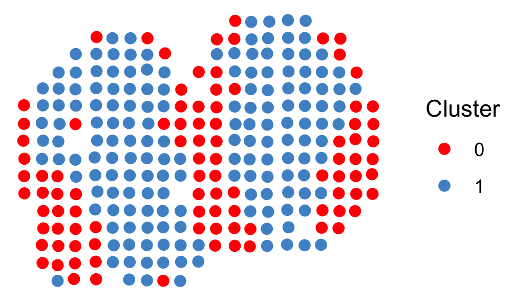

# iMOSCATO

A Bayesian <ins>i</ins>ntergrative <ins>M</ins><ins>O</ins>del of <ins>S</ins>ingle <ins>C</ins>ell and Sp<ins>A</ins>tially Resolved <ins>T</ins>ranscript<ins>O</ins>mics Data

## Introduction

**iMOSCATO** is a fully Bayesian model that integrates single-cell RNA sequencing (scRNA-seq) and spatially resolved transcriptomics (SRT) data to to simultaneously decompose cell-type compositions of regularly distributed spots and identify the underlying spatial domains. It incorporates the lattice structure by employing a Markov random field prior, improving the accuracy of both cell-type deconvolution and spatial domain detection. Moreover, iMOSCATO employs a zero-inflated Dirichlet distribution to capture cell-type sparsity.



## Software requirements

**iMOSCATO** was developed and tested under `R 4.5.1`. The following R packages are required:

- Rcpp
- RcppArmadillo
- RcppDist
- SingleCellExperiment
- Seurat
- igraph
- edgeR
- scuttle
- scran
- mcclust
- ggplot2
- gridExtra
- ggpubr
- reshape2
- gtools
- scatterpie
- ggpubr
- mclust

## Data preparation and required input format
**iMOSCATO** requires two types of input data:

1. scRNA-seq reference data, including a raw count matrix and cell-type annotations.
2. Spatial transcriptomics data, including a raw count matrix and spatial coordinates.

For datasets downloaded from GEO or other public repositories, users should first extract the corresponding count matrices, cell-type annotation information, and spatial-coordinate information and organize them into the following four inputs required by iMOSCATO:

sc_count: a matrix of raw scRNA-seq counts, where each row represents a cell and each column represents a gene.
sc_meta: a data frame containing metadata for the scRNA-seq cells. It must contain a column specifying the cell-type annotation for each cell.
st_count: a matrix of raw SRT counts, where each row represents a spatial spot and each column represents a gene.
loc: a data frame containing two columns representing the spatial x and y coordinates of each spot.

The cell identifiers in sc_count should correspond to those in sc_meta, and the spot identifiers in st_count should correspond to those in loc. Gene identifiers should also be consistently formatted between the scRNA-seq and SRT datasets.

The demo dataset included in this repository provides an example of the required structure and format of these four inputs and can be used as a template when preparing data downloaded from GEO or other public repositories.

Users do not need to normalize the count matrices before creating the iMOSCATO object. The major preprocessing steps are performed internally by the create.iMOSCATO function.

## Preprocessing performed by iMOSCATO

After the four required inputs are prepared, `create.iMOSCATO` performs the main preprocessing steps automatically, including:

1. Quality control of the scRNA-seq data.
2. Quality control of the SRT data.
3. Matching genes between the scRNA-seq and SRT datasets.
4. Calculation of sample-specific size factors.
5. Construction of the reference basis matrix from the scRNA-seq data.
6. Construction of the spatial-neighbor structure using the SRT spatial coordinates.

The corresponding filtering and preprocessing options can be controlled through the arguments of `create.iMOSCATO`, as described below.

## Run iMOSCATO on demo data
The following example illustrates how to run iMOSCATO using the demo dataset provided in this repository.

### Load iMOSCATO and demo data

```r
source("R/imoscato.R")
load("data/demo.Rdata")
```
The demo data contain the four required inputs: `sc_count`, `sc_meta`, `st_count`, and `loc`.

### Create iMOSCATO object
Once the raw data have been organized into the required input formats, the iMOSCATO object can be created using the `create.iMOSCATO` function.

The essential inputs and preprocessing arguments are:

- sc_count: a matrix of raw scRNA-seq count data, each row represents a cell and each column represents a gene. The scRNA-seq data serve as the reference for cell-type deconvolution of the SRT data.
- sc_meta: a data frame containing scRNA-seq metadata. It must include a column indicating the cell-type assignment for each cell, such as the `cellType` column in the demo data.
- st_count: a matrix of raw SRT count data, each row represents a spatial spot and each column represents a gene. This is the SRT data that we are interested to deconvolute.
- loc: a data frame with two columns representing the $x$ and $y$ coordinates of each spatial spot.
- cutoff_sample: a number indicating that spots are kept with at least this number of total counts across all genes. The default is 100.
- cutoff_feature: a number indicating that genes are kept with at least this percent of spots with non-zero counts. The default is 0.1.
- norm_method: a character string specifying the method to calculate the sample-specific size factor, must be one of `tss`, `q75`, `rle`, or `tmm`. The default is `tss`.
- platform: a character string specifying the SRT technology in order to construct neighbor structure, must be one of `ST`, `Visium`, or `other` (for any technologies other than `ST` and `10x Visium`). The default is `ST`.


```r
iMOSCATO.object <- create.iMOSCATO(
  sc_count = sc_count, 
  sc_meta = sc_meta, 
  st_count = st_count, 
  loc = loc,
  cutoff_sample = 100, 
  cutoff_feature = 0.1,
  norm_method = "tss", 
  platform = "ST")

## Quality control on scRNA-seq data! 
## Quality control on spatially resolved transcriptomics data! 
## Joint calculation of sample-specific size factor! 
## Create reference basis matrix from scRNA-seq data! 
## Construct neighbor structure using spatial transcriptomics geospatial profile! 
```

### Run iMOSCATO
We run iMOSCATO using `run.iMOSCATO` function. The essential inputs are:

- iMOSCATO.object: the iMOSCATO object created by `create.iMOSCATO` function.
- n.domain: the specified number of domains.
- iter: a number indicating the total number of iterations. The default is `2000`.
- burn: a number indicating the number of burn-in iterations. The default is `1000`.

```r
iMOSCATO.object = run.iMOSCATO(
  iMOSCATO.object = iMOSCATO.object, 
  n.domain = D, 
  iter = 2000,
  burn = 1000)

## iMOSCATO starts! 
10% has been done
20% has been done
30% has been done
40% has been done
50% has been done
60% has been done
70% has been done
80% has been done
90% has been done
100% has been done
## iMOSCATO finishs! Run time is 22 seconds!
```

### Cell-type deconvolution
The estimated cell-type proportions are stored in `iMOSCATO.object$result$prop_result`.

```r
prop_result <- iMOSCATO.object$result$prop_result
head(prop_result)

      cellType1 cellType2 cellType3  cellType4
17x9  0.4065791 0.1310758 0.2399779 0.22236721
17x11 0.0000000 0.0000000 0.3653637 0.63463632
17x10 0.4856170 0.0000000 0.3627650 0.15161792
17x12 0.5103974 0.2280210 0.1057223 0.15585933
17x13 0.4055590 0.1122657 0.3510774 0.13109798
17x15 0.8151836 0.0000000 0.1145933 0.07022304
```
The estimated cell-type proportion matrix can be visualized using the `plot.pie` function.

```r
colors = c("#6E98FF", "#7FC97F", "#E7298A", "#FFD92F")
colnames(prop_result) <- 1:4
p = CARD::CARD.visualize.pie(proportion = prop_result, 
                   spatial_location = iMOSCATO.object$object@loc,
                   colors = colors) +
  theme(legend.title=element_text(size = 8),
        legend.text=element_text(size = 8),
        legend.box.spacing = unit(0, "pt")) 
print(p)
```


### Spatial domain detection
The estimated spatial domian labels are stored in `iMOSCATO.object$result$domain_result`.

```r
domain_result = iMOSCATO.object$result$domain_result
head(domain_result)

           x      y domain domain_map dominant_type
17x9  16.920  9.015      1          1     cellType1
17x11 16.945 11.075      1          1     cellType4
17x10 16.970 10.118      1          1     cellType1
17x12 16.939 12.132      1          1     cellType1
17x13 16.949 13.055      1          1     cellType1
17x15 16.942 15.088      1          1     cellType1
```
The estimated spatial domains can be visualized using the `plot.domain` function.

```r
p <- plot.domain(domain_result[,c("x","y")], size = 2, domain = domain_result$domain, colors = c("red", "steelblue3"))
print(p)
```



