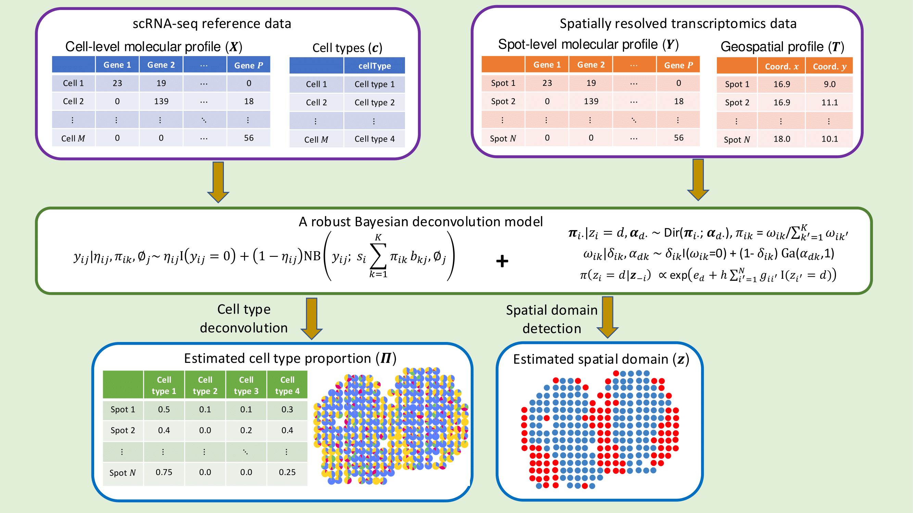
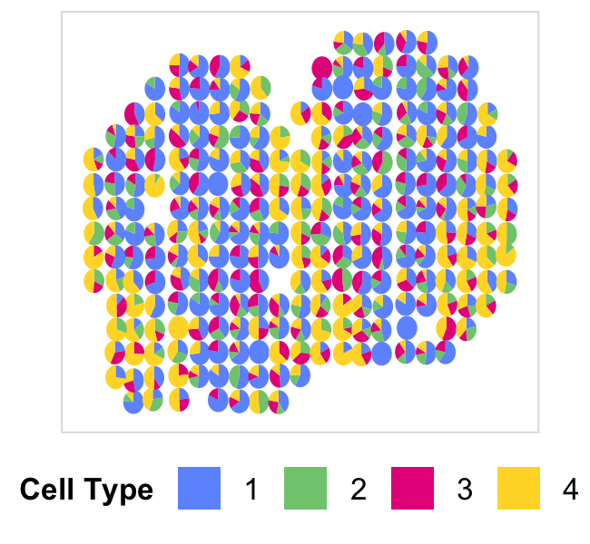

# iMOSCATO

Bayesian <ins>i</ins>ntergrative <ins>M</ins><ins>O</ins>deling of <ins>S</ins>ingle <ins>C</ins>ell and Sp<ins>A</ins>tial <ins>T</ins>ranscript<ins>O</ins>mics Data

## Introduction

**iMOSCATO** is a Bayesian model that integrates single-cell RNA sequencing (scRNA-seq) and spatially resolved transcriptomics (SRT) data to to simultaneously decompose cell-type compositions of regularly distributed spots and identify the underlying spatial domains. It incorporates the lattice structure by employing a zero-inflated Dirichlet distribution to capture cell-type sparsity.



**iMOSCATO** was developed and tested under `R 4.4.2`. The following R packages are required to run the model

- Rcpp
- RcppArmadillo
- RcppDist
- SingleCellExperiment
- Seurat
- igraph
- edgeR
- scuttle
- scran
- mcclust
- ggplot2
- gridExtra
- ggpubr

## Run iMOSCATO on demo data

The following section will guide to run a exemplary data using **iMOSCATO**.

### Load iMOSCATO and demo data
**iMOSCATO** requires two types of input data:

1. scRNA-seq count data, along with meta information indicating the cell type information for each cell.
2. Spatial transcriptomics count data, along with spatial location information.
   
```r
source("R/imoscato.R")
load("data/demo.Rdata")
```

### Create iMOSCATO object
The iMOSCATO object is created by the `create.iMOSCATO` function. The essential inputs are:

- sc_count: a matrix of raw scRNA-seq count data, each row represents a cell and each column represents a gene. This sc_count data serves as a reference for the cell type deconvolution for SRT data.
- sc_meta: a data frame of scRNA-seq meta data. The sc_meta data must contain the column indicating the cell type assignment for each cell (e.g., `cellType` column in the example sc_meta data).
- st_count: a matrix of raw SRT count data, each row represents a spot and each column represents a gene. This is the SRT data that we are interested to deconvolute.
- loc: a data frame with two columns representing the $x$ and $y$ coordinates of the spot.
- cutoff_sample: a number indicating that spots are kept with at least this number of total counts across all genes. Default is 100.
- cutoff_feature: a number indicating that genes are kept with at least this percent of spots with non-zero counts. Default is 0.1.
- norm_method: a character string specifying the method to calculate the sample-specific size factor, must be one of `tss`, `q75`, `rle`, or `tmm`. Default is `tss`.
- platform: a character string specifying the SRT technology in order to construct neighbor structure, must be one of `ST`, `Visium`, or `other` (for any technologies other than `ST` and `10x Visium`). Default is `ST`.


```r
iMOSCATO.object <- create.iMOSCATO(
  sc_count = sc_count, 
  sc_meta = sc_meta, 
  st_count = st_count, 
  loc = loc,
  cutoff_sample = 100, 
  cutoff_feature = 0.1,
  norm_method = "tss", 
  platform = "ST")

## Quality control on scRNA-seq data! 
## Quality control on spatially resolved transcriptomics data! 
## Joint calculation of sample-specific size factor! 
## Create reference basis matrix from scRNA-seq data! 
## Construct neighbor structure using spatial transcriptomics geospatial profile! 
```

### Run iMOSCATO
We run iMOSCATO using `run.iMOSCATO` function. The essential inputs are:

- iMOSCATO.object: iMOSCATO object created by `create.iMOSCATO` function.
- n.domain: Specified number of domains.
- iter: a number indicating the total number of iterations. Default is `2000`.
- burn: a number indicating the number of burn-in iterations. Default is `1000`.

```r
iMOSCATO.object = run.iMOSCATO(
  iMOSCATO.object = iMOSCATO.object, 
  n.domain = D, 
  iter = 2000,
  burn = 1000)

## iMOSCATO starts! 
10% has been done
20% has been done
30% has been done
40% has been done
50% has been done
60% has been done
70% has been done
80% has been done
90% has been done
100% has been done
## iMOSCATO finishs! Run time is 22 seconds!
```

### Cell-type deconvolution
The estimated cell type proportions is stored in `iMOSCATO.object$result$prop_result`.

```r
prop_result <- iMOSCATO.object$result$prop_result
head(prop_result)

      cellType1 cellType2 cellType3  cellType4
17x9  0.4065791 0.1310758 0.2399779 0.22236721
17x11 0.0000000 0.0000000 0.3653637 0.63463632
17x10 0.4856170 0.0000000 0.3627650 0.15161792
17x12 0.5103974 0.2280210 0.1057223 0.15585933
17x13 0.4055590 0.1122657 0.3510774 0.13109798
17x15 0.8151836 0.0000000 0.1145933 0.07022304
```
We can visualize the cell type proportion matrix through scatterpie plot via `CARD.visualize.pie` function in R package `CARD`.

```r
colors = c("#6E98FF", "#7FC97F", "#E7298A", "#FFD92F")
colnames(prop_result) <- 1:4
p = CARD::CARD.visualize.pie(proportion = prop_result, 
                   spatial_location = iMOSCATO.object$object@loc,
                   colors = colors) +
  theme(legend.title=element_text(size = 8),
        legend.text=element_text(size = 8),
        legend.box.spacing = unit(0, "pt")) 
print(p)
```


### Spatial domain detection
The estimated spatial domian labels is stored in `iMOSCATO.object$result$domain_result`.

```r
domain_result = iMOSCATO.object$result$domain_result
head(domain_result)

           x      y domain domain_map dominant_type
17x9  16.920  9.015      1          1     cellType1
17x11 16.945 11.075      1          1     cellType4
17x10 16.970 10.118      1          1     cellType1
17x12 16.939 12.132      1          1     cellType1
17x13 16.949 13.055      1          1     cellType1
17x15 16.942 15.088      1          1     cellType1
```
We can visualize the spatial domains via `plot.domain` function.

```r
p <- plot.domain(domain_result[,c("x","y")], size = 2, domain = domain_result$domain, colors = c("red", "steelblue3"))
print(p)
```


